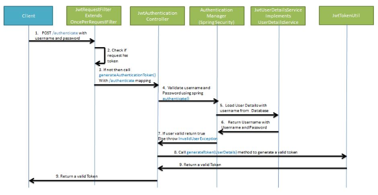
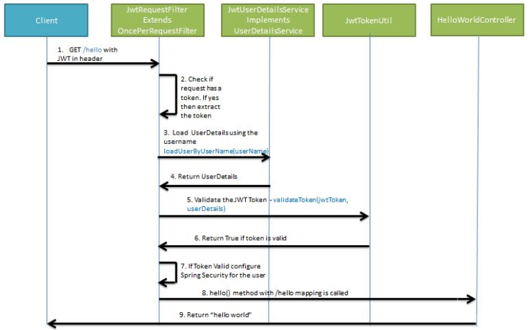

#Spring Boot + JWT

Para una mejor comprensión iremos desarrollando el proyecto por etapas.

## 1- Modelo de negocio

## 2- Implementamos MySQL + JPA

1- Agregue las [dependencias](pom.xml) de MySQL y JPA.

2- Defina las [propiedades](src/main/resources/application.properties) de la base de datos.

### Usuario

1- Creamos la clase [AppUser](src/main/java/com/example/ApiRestClinica/model/AppUser.java) en modelo o entities para persistir los datos en la base de datos.

2- Podriamos definir una clase UserDTO (lo ideal), la cual es responsable de obtener valores de usuario y pasarlos a la capa DAO o Repository.

3- A continuación, definimos UserDao o [UserRepository](src/main/java/com/example/ApiRestClinica/repository/UserRepository.java), que es una interfaz que amplía la clase CrudRepository de Spring Framework.

## 3- Spring Security + JWT
Configure Spring Security para JWT. Exponga la API REST POST con asignación/autenticación mediante la cual el usuario obtendrá un token web JSON válido. Y luego permita que el usuario acceda a la api solo si tiene un token válido.

1- Agregue las [dependencias](pom.xml) de Spring Security y JWT.

### Generación de JWT
Exponga una API POST con mapeo /autenticación . Al pasar el nombre de usuario y la contraseña correctos, generará un token web JSON (JWT)

### Validación de JWT
Si el usuario intenta acceder a la API GET. Permitirá el acceso solo si la solicitud tiene un token web JSON (JWT) válido.

### Pasos

1- [JwtUtil](src/main/java/com/example/ApiRestClinica/util/JwtUtil.java) es responsable de realizar operaciones JWT como creación y validación. Hace uso de io.jsonwebtoken.Jwts para lograr esto.

2- [JwtUserDetailsService](src/main/java/com/example/ApiRestClinica/service/jwt/JwtUserDetailsService.java) implementa la interfaz UserDetailsService de Spring Security. Anula el loadUserByUsername para obtener detalles del usuario de la base de datos utilizando el nombre de usuario. Spring Security Authentication Manager llama a este método para obtener los detalles del usuario de la base de datos al autenticar los detalles del usuario proporcionados por el usuario. Aquí obtenemos los detalles del usuario de una lista de usuarios codificada. Además, la contraseña de un usuario se almacena en formato cifrado mediante BCrypt.

3- Exponer una API POST/autenticar usando [JwtAuthController](src/main/java/com/example/ApiRestClinica/controller/jwt/JwtAuthController.java). La API POST obtiene el nombre de usuario y la contraseña en el cuerpo: con Spring Authentication Manager autenticamos el nombre de usuario y la contraseña. Si las credenciales son válidas, se crea un token JWT con JWTTokenUtil y se proporciona al cliente.

4- [AuthenticationRequest](src/main/java/com/example/ApiRestClinica/model/jwt/AuthenticationRequest.java) es necesaria para almacenar el nombre de usuario y la contraseña que recibimos del cliente.

5- [AuthenticationResponse](src/main/java/com/example/ApiRestClinica/model/jwt/AuthenticationResponse.java) es necesaria para crear una respuesta que contenga el JWT que se devolverá al usuario.

6- [JwtRequestFilter](src/main/java/com/example/ApiRestClinica/config/jwt/JwtRequestFilter.java) amplía la clase OncePerRequestFilter de Spring Web Filter. Para cualquier solicitud entrante, esta clase de filtro se ejecuta. Comprueba si la solicitud tiene un token JWT válido. Si tiene un token JWT válido, establece la autenticación en el contexto para especificar que el usuario actual está autenticado.

7- [JwtAuthenticationEntryPoint](src/main/java/com/example/ApiRestClinica/config/jwt/JwtAuthenticationEntryPoint.java) extiende de la clase AuthenticationEntryPoint de Spring y anula su método begin. Rechaza todas las solicitudes no autenticadas y envía el código de error 401.

8- [SecurityConfiguration](src/main/java/com/example/ApiRestClinica/config/SecurityConfiguration.java) amplía WebSecurityConfigurerAdapter, es una clase conveniente que permite la personalización de WebSecurity y HttpSecurity.

9- Damos permiso en [SecurityConfiguration](src/main/java/com/example/ApiRestClinica/config/SecurityConfiguration.java) a la url/registro para que Spring Security no los bloquee.